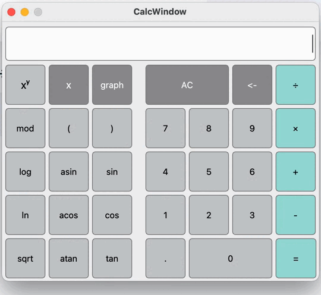

# SmartCalculator

This project implements a calculator with support for both arithmetic operations and mathematical functions. 

The calculation takes place using the reverse Polish notation. 

Plotting a graph of a function given by an expression in infix notation with the variable _x_ (with coordinate axes, mark of the used scale and an adaptive grid). 

Both integers and real numbers with a dot can be input into the program, and it is also possible to enter numbers in the exponential number system.

The project implements the mvc pattern.

